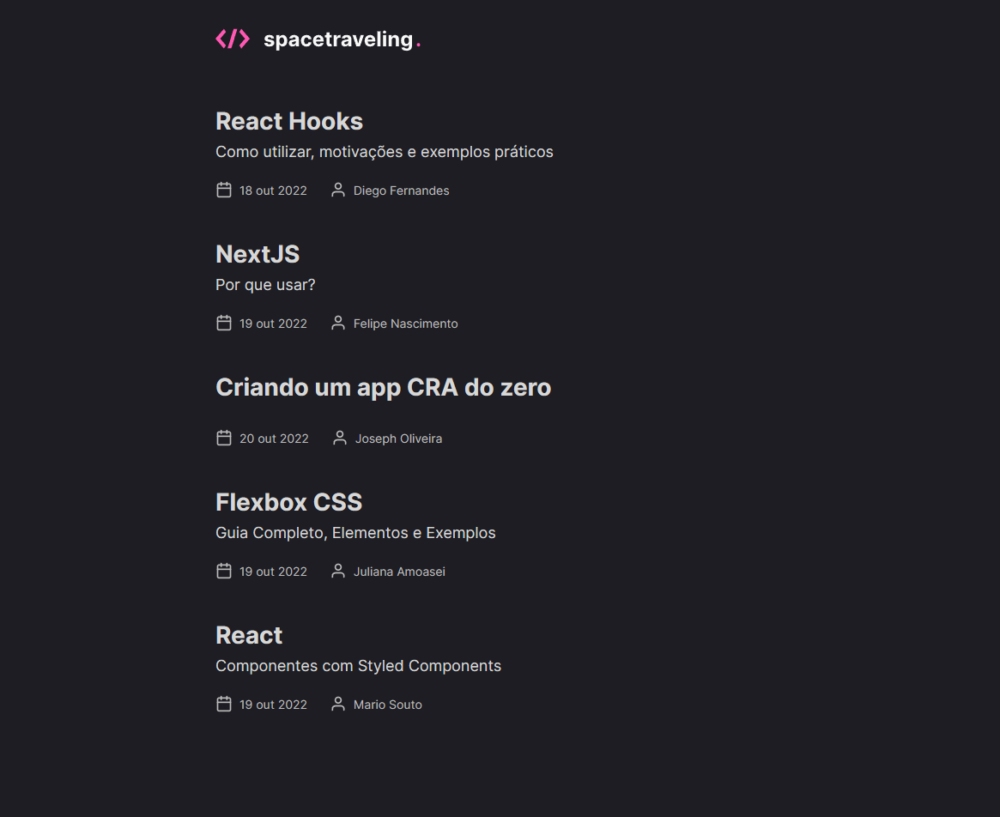
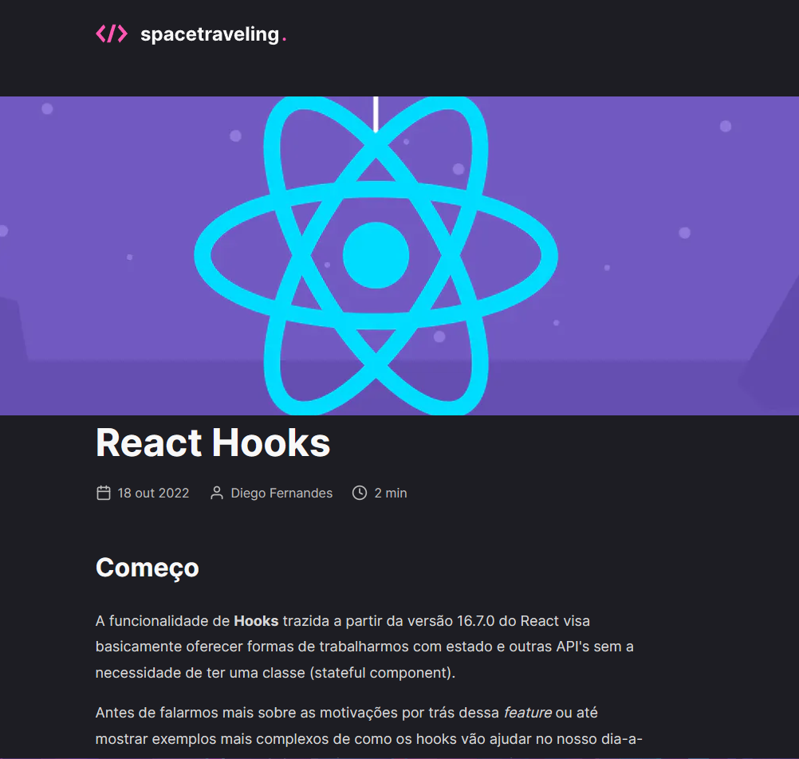

# Space Travelling - Blog

  

## Descrição

Um Blog de tecnologia conectado a um HeadlessCMS para poder ser criado e enviados os seus posts em tempo real

### Screenshot

### Tecnologias utilizadas:

### Links

-  Site hospedado: [Space Travelling](https://ignite-reactjs-ifom.vercel.app/)

## Autor

-  Linkedin - [Guilherme Vitória](https://www.linkedin.com/in/glsvitoria/)
-  GitHub - [glsvitoria](https://github.com/glsvitoria)
-  Instagram - [glsvitoria](https://www.instagram.com/glsvitoria/)